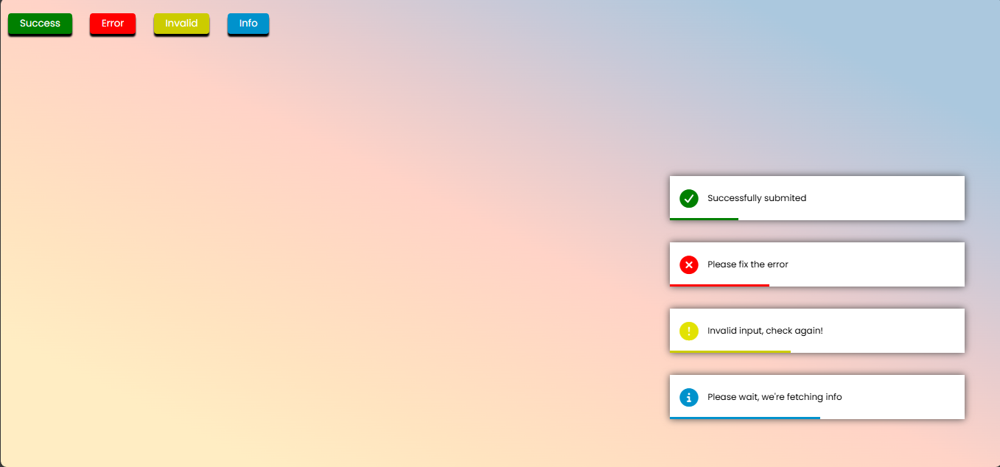

# 📱 Dynamic Toast Notification System

[**🌐 Check Website**](https://gausha606.github.io/toastnotification.github.io/)

## Ek production-ready Notification system jo Data-Driven Architecture aur Non-Blocking UI principles par based hai. Ye system multiple toast states (Success, Error, Invalid, Info) ko asynchronously manage karta hai.

## 🚀 Features

- **Data-Driven Mapping:** Logic ko hardcode karne ki jagah ek centralized message object ka use kiya gaya hai, jisse naye states add karna scalable ho jata hai.

- **Asynchronous Lifecycle Management:** Har notification ka apna independent lifecycle (Entry -> Display -> Exit -> Deletion) hota hai jo setTimeout aur CSS animations ke coordination se chalta hai.

- **Decoupled Event Handling:** `addEventListener` ka use karke logic aur structure ko alag rakha gaya hai (Separation of Concerns).

- **UX-First Animations:**
  - Entry: Smooth moveLeft linear animation (0.5s).
  - Exit: Professional moveRight slide-out (1s) jo user ko visual confirmation deta hai cleanup ka.
  - Progress Tracking: CSS ::after element se real-time visibility timeout indicator.

## 🛠️ Tech Stack

| Technology          | Use Case                                |
| :------------------ | :-------------------------------------- |
| **HTML5**           | For structure and semantic layout for . |
| **CSS3**            | For interactive design and styling.     |
| **JavaScript**      | For updation in DOM dynamically.        |
| **FontAwesome 7.0** | For Vectorized semantic iconography.    |

## 🧠 Logic & State Management

Project ka core logic ek createToast(type) engine par tika hai:

1. Extraction: Parametric type ke aadhar par message object se HTML aur metadata fetch kiya jata hai.

2. Mounting: Dynamic div create karke use unique state class (e.g., success, error) di jati hai aur toastDiv mein inject kiya jata hai.

3. Cleanup Pipeline: \* setTimeout+5000ms: .remove class add karke exit animation trigger hota hai.

  - setTimeout+6000ms: Node ko DOM se permanent remove kar diya jata hai (Memory optimization).

## 📦 Installation & Setup

Project ko local machine par chalane ke liye niche diye gaye steps follow karein:

Repository Clone karein:

```Bash
git clone https://github.com/Gausha606/toastnotification.github.io.git
```

Project Folder mein jayein:

```Bash
cd toastnotification
```

Run karein:
`index.html` file ko browser mein open karein (Preferably using Live Server).

---

## 📁 Project Structure

```text
├── index.html          # Semantic entry point & Toast container
├── style.css           # Animation sequences & State-based themes
├── script.js           # Core notification engine & Event listeners
└── README.md           # Project Documentation
```

## 📸 Interface Preview


